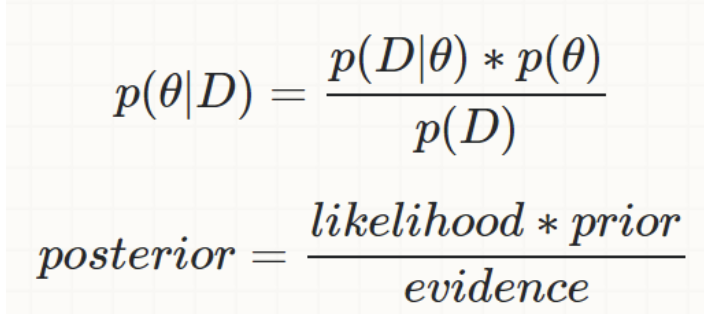
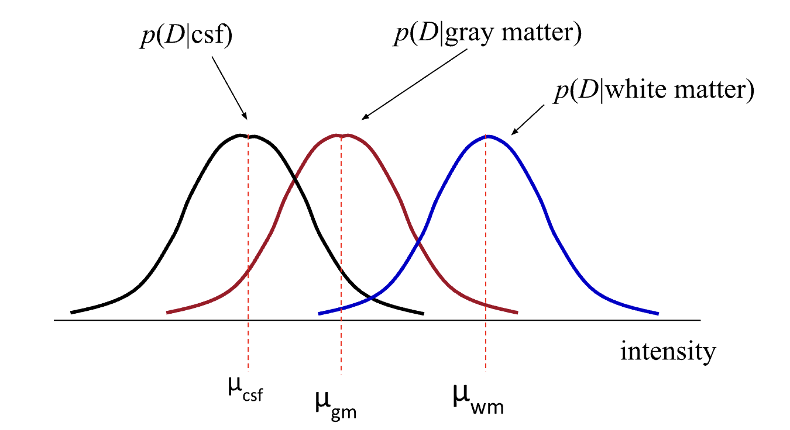

# Probabilistic brain tissue segmentation using MultiAtlases using Matlab

The Bayesian classifier models the probabilistic relationships between the attribute set and the class variables, which are then used for estimating the class probability of the unknown variable. This model involves Bayesian inference such as maximum a posteriori (MAP) estimation, where the goal is to estimate the label output image ϴ given the observed image D by minimizing the posterior distribution  P(ϴ /D) of the possible labels  ϴ:

    ϴ=argmax P(ϴ /D) 

The Bayesian framework consists of three probability distributions: the prior distribution P(ϴ), the posterior distribution P(ϴ /D), and the conditional distribution  (also called the likelihood function) P(D/ ϴ). The prior distribution embodies the knowledge of likely configurations before an actual image is observed. The posterior distribution is derived after an observation has been made and the likelihood is defined as the probability of obtaining a particular observation given a set of model parameters.
Let’s assume that a set of probability distribution parameters, θ, best explains the dataset D. We may wish to estimate the parameters θ with the help of the Bayes’ Rule.  The Bayes rule describes the relation between the posterior probability, prior probability , and likelihood  as follows:

The Maximum a Posteriori (MAP) estimator assigns to each voxel that class which maximizes
    
    ϴ = argmax P(D/ϴ)P(ϴ)

where ϴ ∈{WM,GM,CSF.} D- Data Intensity in the voxel. Classification of new data is obtained by assigning each pixel to the class with the highest posterior probability.

## Likelihood function

In the case of the brain MRI segmentation, often it is assumed that the pixel intensities are independent samples from a mixture of Gaussian probability distributions. 

